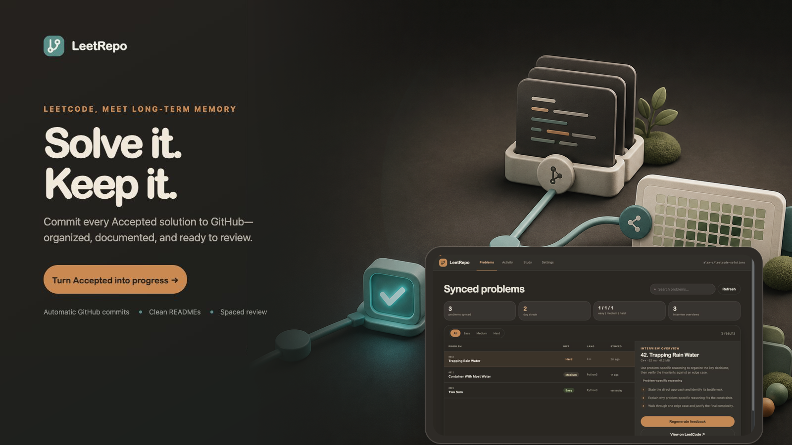
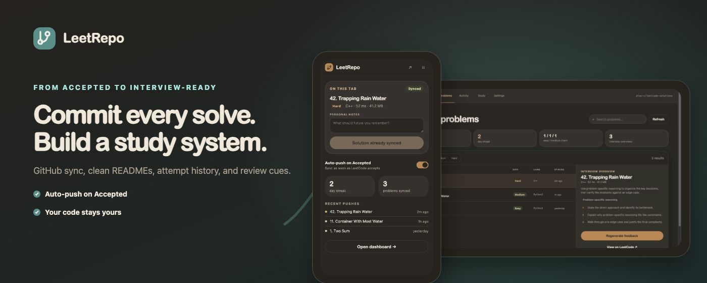
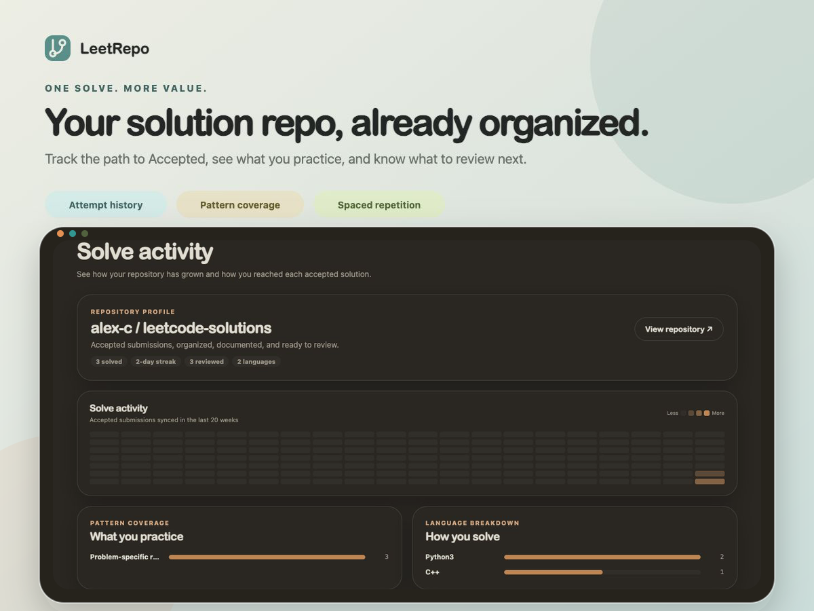

# LeetRepo

<p align="center">
  <strong>Solve it. Keep it.</strong><br>
  Turn every Accepted LeetCode submission into a clean GitHub archive and a study system built from your own solutions.
</p>



LeetRepo is a dependency-free Chrome/Chromium Manifest V3 extension. It captures the path to Accepted, commits the final solution to GitHub, generates a problem README, and keeps the result ready for interview review.

**Automatic GitHub commits · Clean problem READMEs · Attempt history · Pattern analytics · Spaced repetition**

## Why LeetRepo

An Accepted submission is useful for a few seconds. The reasoning behind it can stay useful for years.

LeetRepo removes the copy-paste ritual between LeetCode and GitHub, then turns the archive into something you can actually study:

- **Capture automatically.** Push manually, or arm auto-push by clicking LeetCode's Submit button and receiving a fresh Accepted result for that exact editor code.
- **Organize by default.** Store each problem in a predictable folder with language-specific solutions and one generated README.
- **Remember the path.** Keep accepted and failed attempts, personal notes, runtimes, memory results, and interview overviews together.
- **Review deliberately.** See pattern coverage, language usage, study gaps, and solutions due for spaced repetition.
- **Keep control.** Choose the GitHub repository, opt in to AI explanations, and keep a local dashboard index that works offline.



## How it works

1. **Solve on LeetCode.** LeetRepo reads the current problem, editor language, code, submission result, and available performance metrics.
2. **Confirm the solution.** Push from the in-page panel or toolbar popup, or let a newly Accepted submission trigger auto-push.
3. **Commit atomically.** LeetRepo creates or updates the problem folder and advances the repository branch in one multi-file commit.
4. **Review later.** The local dashboard turns synced solutions into a searchable library, activity view, and study queue.

A synced problem follows this shape:

```text
0001-two-sum/
├── README.md
└── python/
    └── solution.py
```

The generated README can include solve metadata, the captured problem context, complexity, personal notes, interview prompts, and a replay of the approach. Pushing another language updates the same problem folder without resetting the original solved time.

## Built for the next interview



The dashboard separates three jobs that usually get mixed together:

### Problems

Search and filter the solution library, inspect a problem's interview overview, and jump back to LeetCode or the GitHub commit.

### Activity

See repository growth, solve activity, pattern coverage, language breakdown, and the full sequence of failed and accepted attempts.

### Study

Surface solutions 30 days after they are synced or reviewed, snooze a review for three days, find missing patterns, and create shareable progress cards locally.

## Install locally

LeetRepo has no build step and no runtime dependencies.

1. Configure GitHub sign-in using the instructions below.
2. Open `chrome://extensions` in Chrome or Chromium.
3. Enable **Developer mode**.
4. Choose **Load unpacked** and select this repository.
5. Open LeetRepo and complete onboarding.

## Configure GitHub sign-in

LeetRepo uses GitHub's OAuth device flow, so users sign in with GitHub instead of creating and pasting a personal access token.

1. Create a GitHub OAuth app under **Settings → Developer settings → OAuth Apps**. Use the project's URL for the homepage and callback fields; device flow does not use the callback.
2. Open the OAuth app's settings and enable **Device Flow**.
3. Copy its public client ID into `GITHUB_OAUTH_CLIENT_ID` in [`src/config.js`](src/config.js). Do not add the client secret to the extension.
4. Reload LeetRepo from `chrome://extensions`.

During onboarding, LeetRepo displays a one-time code and links to GitHub's device authorization page. The resulting OAuth access token is stored in `chrome.storage.local`, is not synced, and is sent only to GitHub.

LeetRepo requests the `repo` scope because it supports public and private repositories. GitHub defines that scope as full repository access. A production deployment that requires repository-by-repository authorization should use a GitHub App and a backend token exchange instead.

## Optional AI explanations

LeetRepo always has local rule-based interview and Mermaid replay templates. AI explanations are optional, use the user's own Groq key, and are disabled by default.

To enable them, open **Settings → AI explanations**, add a [Groq API key](https://console.groq.com/keys), choose a production model, and set a daily request limit.

When enabled:

- The key is stored in `chrome.storage.local`, is excluded from synced settings, and is never returned to extension pages after it is saved.
- Each request contains the problem title, difficulty, language, first detected description paragraph and example input/output, and up to 24,000 characters of solution code.
- Requests use Groq's OpenAI-compatible Chat Completions API with JSON output, a bounded completion size, and a 25-second timeout.
- The default cap is 20 attempted requests per UTC day, configurable from 1 to 100. Failed attempts count toward the limit.
- If Groq is unavailable, rejects the key, returns invalid output, or reaches the limit, the GitHub push continues with local templates.
- AI-generated READMEs include a reminder to verify the analysis.

The request cap is a per-install guardrail, not an access-control or billing boundary. A future shared service key would require an authenticated server-side proxy with durable rate limits, payload limits, abuse monitoring, and provider-level spend caps. A shared provider key should never be bundled in the extension.

## Data handling and safety

- GitHub and Groq credentials stay in local extension storage and are not synced.
- Shareable stats are rendered locally and copied or shared only after an explicit click.
- Repository-profile generation is opt-in because it replaces the destination repository's root `README.md`.
- Before moving a GitHub branch, LeetRepo reads the proposed tree back and aborts unless every existing repository file is still present and unchanged.
- Existing LeetRepo-style folders can be imported from the selected repository to rebuild the local dashboard index.

## Privacy, terms, and license

- **Privacy:** Read the [LeetRepo Privacy Notice](PRIVACY.md) before installing. It explains what data stays on your device, what is sent to GitHub or Groq, how credentials are stored, and how to remove saved data.
- **Terms:** Use of LeetRepo is subject to the [Terms and Conditions](TERMS.md), including user responsibilities, third-party service terms, and warranty limitations.
- **License:** LeetRepo's source code is available under the [MIT License](LICENSE).

## Development

Run the test suite:

```bash
npm test
```

The extraction code intentionally uses several fallback selectors because LeetCode changes its DOM regularly.

### Repository structure

```text
assets/
  marketing/             Campaign artboards, product captures, and final PNGs
  icon.svg               Extension icon source
src/
  background/            Manifest V3 service worker
  content/               LeetCode page integration
  core/                  Submission, GitHub, and explanation logic
  pages/                 Popup, options, onboarding, and dashboard UIs
  shared/                Shared UI helpers and styles
tests/                   Node unit tests
manifest.json            Extension entry point and permissions
```
