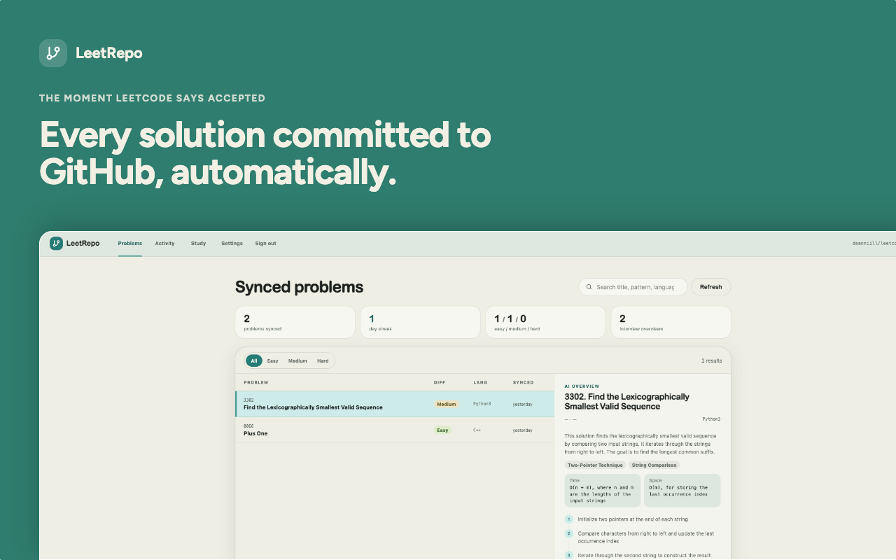
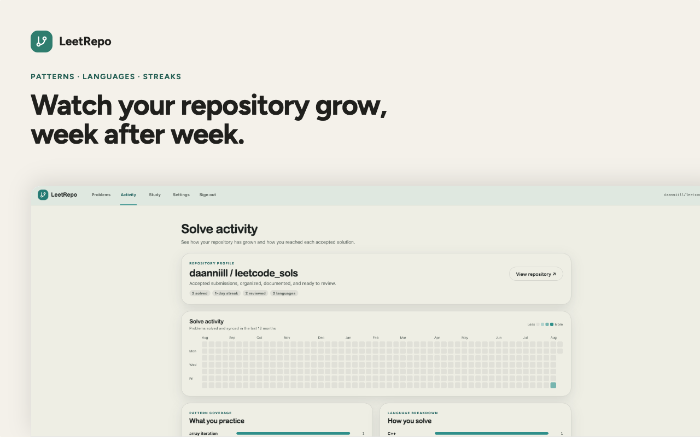
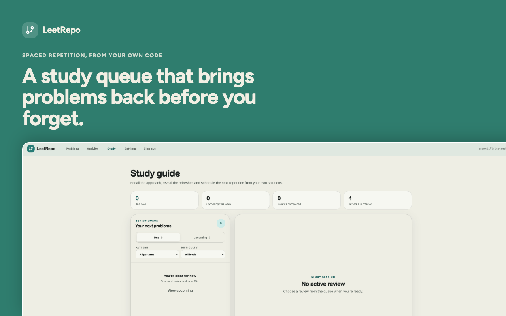
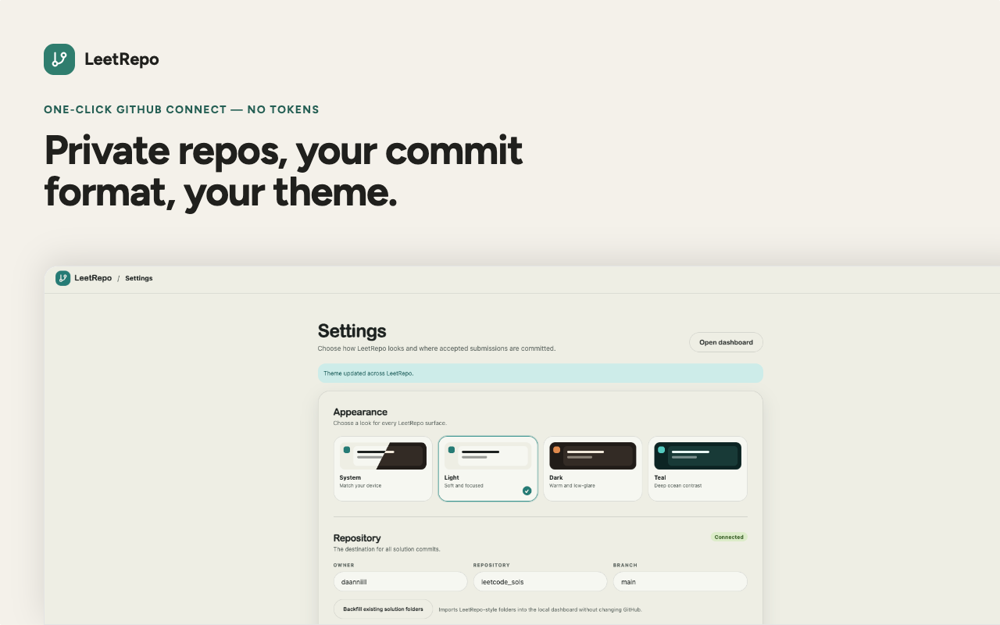

# LeetRepo

<p align="center">
  <strong>Solve it. Keep it.</strong><br>
  Turn every Accepted LeetCode submission into an organized GitHub archive and a study system built from your own solutions.
</p>


LeetRepo is a Chrome/Chromium extension that saves Accepted LeetCode solutions to GitHub—complete with problem context, solve metadata, and optional AI-generated interview notes. Its built-in dashboard then helps you search, analyze, and review what you have solved.

**Automatic GitHub commits · Clean problem READMEs · Attempt history · Pattern analytics · Spaced repetition**

## What you can do

- **Save solutions automatically.** Push from LeetCode without copying and pasting code.
- **Keep your repository organized.** Store each problem, language, and README in a predictable structure.
- **Learn from every attempt.** Preserve failed and Accepted submissions so you can revisit your reasoning.
- **Prepare for interviews.** Search by pattern or difficulty and review problems on a spaced-repetition schedule.
- **Choose whether to use AI.** AI-generated notes are opt-in; the core GitHub workflow works without them.

## How it works

1. **Solve a problem on LeetCode.** LeetRepo detects the problem, language, code, result, and available performance metrics.
2. **Confirm the solution.** Push from the page panel or toolbar popup, or enable automatic pushes for newly Accepted submissions.
3. **Sync one clean commit.** LeetRepo creates or updates the problem folder without changing unrelated repository files.
4. **Review it later.** Use the local dashboard to search your library, explore activity, and work through your study queue.

A synced problem looks like this:

```text
0001-two-sum/
├── README.md
└── python/
    └── solution.py
```

The generated README can include solve metadata, problem context, complexity, personal notes, interview prompts, and an approach walkthrough. Solving the same problem in another language updates its existing folder while preserving the original solved time.

## Your solution dashboard



### Problems

Search and filter your solution library, read an interview overview, and jump back to the LeetCode problem or GitHub commit.

### Activity

Track repository growth, solve activity, pattern coverage, language usage, and the sequence of failed and Accepted attempts. You can also create a shareable progress image locally.



### Study

Review due and upcoming problems, recall a solution before revealing its refresher, and filter coverage by pattern or difficulty. You choose a review interval in days, weeks, or months; successful recalls use that interval while harder reviews return sooner.



## Run LeetRepo from source

LeetRepo has two parts:

- a dependency-free Manifest V3 browser extension; and
- a Node.js/PostgreSQL service for GitHub sign-in, token refresh, and optional AI notes.

Running the current source version requires your own GitHub App and hosted service.

### Prerequisites

- Chrome or another Chromium-based browser
- A GitHub account and a repository for your solutions
- Node.js 24 or newer
- PostgreSQL
- An HTTPS URL for the service during the GitHub and Chrome identity flow

### 1. Install the service dependencies

```bash
npm install
cp .env.example .env
```

Fill in every required value in [`.env.example`](.env.example). Generate the encryption key with:

```bash
openssl rand -base64 32
```

### 2. Create a GitHub App

Create a GitHub App under an account or organization you control:

- Make it public and enable **Request user authorization (OAuth) during installation**.
- Keep expiring user authorization tokens enabled.
- Set its callback URL to `<PUBLIC_BASE_URL>/v1/auth/github/callback`.
- Grant only **Repository permissions → Contents: Read and write**. GitHub includes Metadata read access automatically.
- Disable webhooks and leave Administration permission disabled.

Add the app slug, client ID, and client secret to `.env`. Never put the client secret in extension code.

### 3. Point the extension at your service

1. Set `LEETREPO_API_BASE_URL` in [`src/config.js`](src/config.js) to your service's HTTPS origin.
2. Replace the API entry in [`manifest.json`](manifest.json) under `host_permissions` with the matching origin pattern, such as `https://api.example.com/*`.
3. Open `chrome://extensions`, enable **Developer mode**, and choose **Load unpacked**.
4. Select this repository.
5. On the LeetRepo extension card, open the service worker under **Inspect views**. In its console, run `chrome.identity.getRedirectURL("github")`.
6. Add the exact returned URL to `EXTENSION_REDIRECT_URIS` in `.env`.
7. Add `chrome-extension://<YOUR_EXTENSION_ID>` to `ALLOWED_EXTENSION_ORIGINS` in `.env`.

The GitHub App callback and Chrome identity redirect are different URLs: the GitHub App uses your service callback, while `EXTENSION_REDIRECT_URIS` uses the `chromiumapp.org` URL returned by Chrome.

### 4. Start the service

```bash
npm run db:migrate
npm start
```

Open LeetRepo from the browser toolbar and complete onboarding. Users choose which repositories the GitHub App may access; they never need to create or paste a personal access token.



For production deployment, Chrome Web Store packaging, monitoring, and rollback guidance, follow the [deployment checklist](DEPLOYMENT.md).

## Optional AI-generated READMEs

AI-generated notes are disabled by default. Users can opt in during onboarding, in Settings, or from the LeetCode page panel. With AI disabled, LeetRepo creates a basic README from captured problem metadata and stats without an interview walkthrough or Mermaid diagram.

When AI is enabled:

- The extension sends the problem title, difficulty, language, detected context and example, and up to 24,000 characters of solution code to the LeetRepo API.
- The API builds the prompt, calls the configured Groq model, validates the response, and returns the generated review and usage counters.
- The free tier allows 3 attempted requests per UTC day and 30 per UTC month.
- Request bodies are not written to the application database or ordinary application logs.
- A service, provider, validation, or quota failure does not block the GitHub push; LeetRepo falls back to the basic README.
- AI-generated READMEs remind users to verify the analysis.

Turning AI off keeps GitHub sync, local rule-based feedback, and stats-only READMEs available.

## Privacy and safety

- GitHub App refresh tokens are encrypted by the service. Short-lived GitHub access tokens and opaque LeetRepo session tokens stay in local extension storage and are not synced.
- The GitHub App has Contents read/write access but no Repository administration permission, so it cannot delete a GitHub repository.
- Shareable stats are rendered locally and copied or shared only after an explicit click.
- Repository-profile generation is opt-in because it replaces the destination repository's root `README.md`.
- Before moving a GitHub branch, LeetRepo reads the proposed tree back and stops unless every existing repository file is still present and unchanged.
- Existing LeetRepo-style folders can be imported to rebuild the local dashboard index.
- Account deletion clears extension storage, revokes GitHub authorization, and deletes hosted data without changing repositories. The GitHub App installation remains until the user removes it in GitHub settings.

Read the [Privacy Notice](PRIVACY.md), [Terms and Conditions](TERMS.md), and [Security Policy](SECURITY.md) for complete details.

## Development

Install exact dependencies and run the test suite:

```bash
npm ci
npm test
```

Create and verify the Chrome Web Store package after setting the production API origin:

```bash
npm run release:check
```

The archive is written to `dist/` and contains only the extension package, public notices, and assets. Server code, dependencies, and environment files are excluded.

LeetCode changes its DOM regularly, so the extraction code intentionally uses several fallback selectors.

### Repository structure

```text
assets/                  Extension icons
server/                  OAuth, token refresh, AI, quotas, and database code
scripts/                 Release packaging and verification helpers
src/
  background/            Manifest V3 service worker
  content/               LeetCode page integration
  core/                  Submission, GitHub, and explanation logic
  pages/                 Popup, settings, onboarding, and dashboard UIs
  shared/                Shared UI helpers and styles
tests/                   Node.js tests
Dockerfile               Production API container
manifest.json            Extension entry point and permissions
```

## License

LeetRepo is available under the [MIT License](LICENSE).
